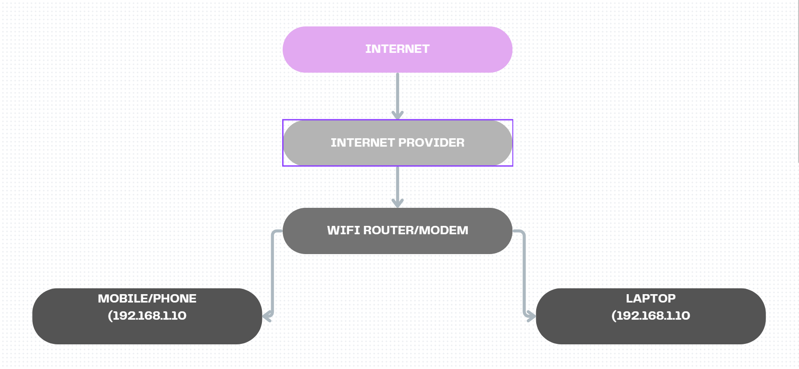
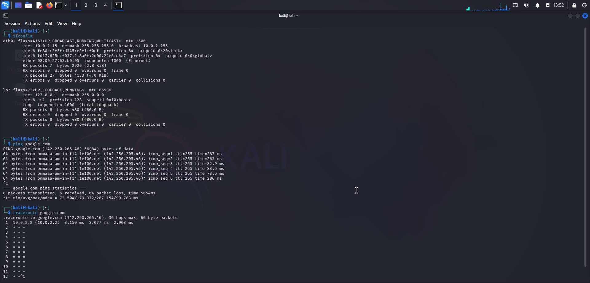

# TASK 1 

# PART A NETWORK INFORMATION 

# PART B 
# What is an IP Address?
When we connect a device to internet then an id is assigned to devices. This id is used to communicate with the devices and to get access to any file on an internet. 
Example: Without ip address is like an student in university without name and roll number.

# What is a MAC Address?
MAC address is a unique hardware address assigned to a network interface card (NIC) by the manufacturer. It is used to identify network in a local network.
Example: mac address is like chassis number of a vehicle.

# What is a Default Gateway? 
A Default Gateway is the device (usually a router) that connects a local network to other networks, such as the Internet. It acts as the exit point for network traffic.
Example: 192.168.1.1

# What is DNS? 
DNS (Domain Name System) is a service that translates human-readable domain names into IP addresses. This allows users to access websites using names instead of numerical addresses.
Example: google.com → 142.250.183.78

# Difference between Public IP and Private IP.
Public IP
Used on the Internet,
Assigned by ISP,
Globally unique,
Accessible from outside
Public IP: 103.21.58.10 

Private IP
Used within a local network
Assigned by router
Can be reused in different networks
Not directly accessible from outside

# PART C 
FLOW CHART 

# PART D 

1. Was the ping successful?
Yes, the ping was successful because replies were received from Google's server.

2. How many hops were shown?
The traceroute showed 12 hops from my device to Google's server.

3. What is the purpose of traceroute?
Traceroute is used to identify the path that data packets take from a source device to a destination server. It helps in troubleshooting network connectivity and performance issues.

Private IP: 192.168.1.5

